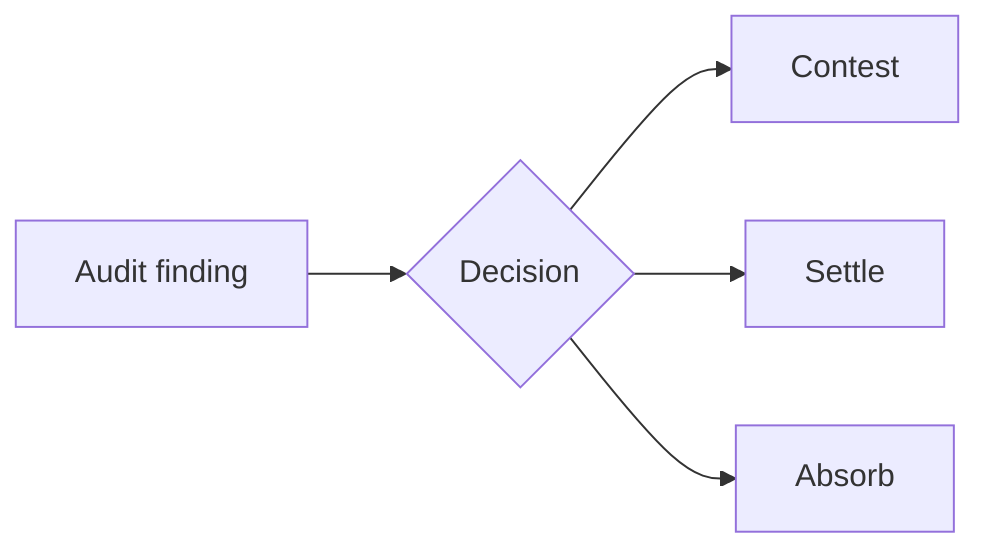

Tax audits are expensive. Not just the settlement amounts — the decision cost. Every audit finding requires a judgment call: contest it, settle it, or absorb it? Each path has different legal costs, time costs, settlement risks, and precedent implications.

_Figure: every finding is a contest / settle / absorb decision with its own cost shape._

At Vertex, we had large enterprise customers managing dozens or hundreds of open audit findings at any moment. Each one is a decision. Most of those decisions were being made by humans using spreadsheets, gut feel, and whoever had the most institutional memory in the room.

That bothered me.

## Audit findings are decisions

The framing that matters here is the one that gets lost: an audit finding is not a problem to be solved, it's a decision to be made. And the right decision shifts based on the jurisdiction, the audit type, current legal precedent, and the company's own risk posture. What's the right call for a finding in California vs. the same finding in Texas? For a sales tax audit vs. an income tax audit? For a company with a generous tax controversy budget vs. one running lean?

Nobody had a good answer. Everyone had an opinion. The decisions were happening anyway — just without a shared frame.

## What I built

A patent-pending decision-support model for audit defense. The patent is still pending, so I won't go further than that on the mechanism. Happy to talk through the problem space under NDA.

## What changed when we deployed it

The first thing that changed wasn't accuracy. It was conversations.

Instead of "I think we should contest this," teams started having a structured conversation about each finding, with the model's recommendation as a starting point rather than a tribal opinion. That's a different conversation. It has data in it. It has an auditable reasoning trail.

The second thing: patterns that had been invisible because they were spread across hundreds of one-at-a-time decisions started becoming visible. Nobody meant for those patterns to exist. They were just the residue of how decisions had historically been made.

That's what good decision-support tooling should do. Not replace the judgment — augment it. Make the implicit explicit. Surface what's invisible when you're making 200 decisions one at a time.

---

*Audit Management decision-support model is patent pending. Developed at Vertex Inc., 2025.*
