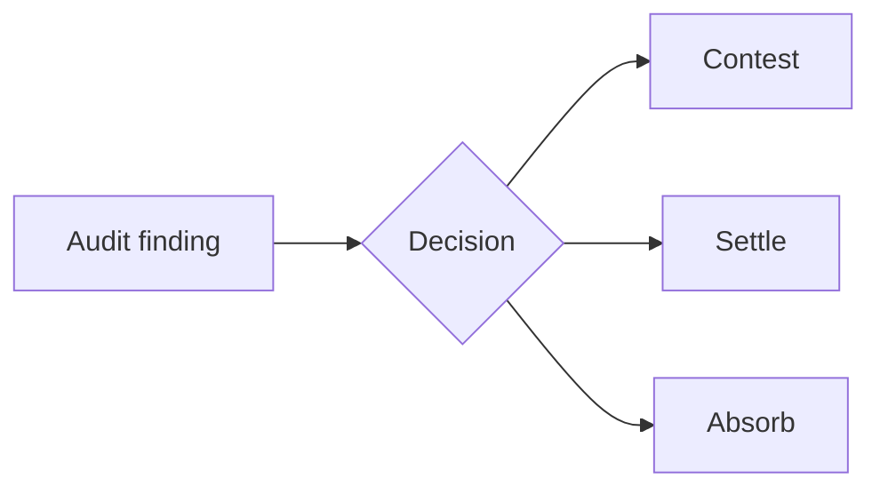

A Fortune 500 tax team I worked with in 2024 had 180 open audit findings on a spreadsheet. The senior controversy lead — one person, twenty-plus years on the job — was the system. When she was out, decisions stalled. When she was in the room, the room deferred.

_Figure: every finding is a contest / settle / absorb decision with its own cost shape._

Every one of those 180 findings is a judgment call. Contest, settle, or absorb. Each path has its own legal cost, its own timeline, its own settlement risk. The right call depends on the jurisdiction, the audit type, current precedent, and what the company can stomach this quarter. Multiply that by hundreds of findings across dozens of customers and you have an industry running on hallway memory.

That bothered me.

## Findings are decisions, not problems

The framing I kept coming back to: an audit finding is not a thing to fix. It's a choice to make. The same finding in California is a different decision than in Texas. A sales tax finding lives on a different clock than an income tax one. A company with a generous controversy budget tolerates risk a lean one can't.

Nobody had a shared frame. Everyone had an opinion. The decisions happened anyway.

## What I built

A patent-pending decision-support model for audit defense. I can't go deeper on the mechanism here — reach out if it's relevant to what you're working on.

## What changed when we deployed it

The first thing that changed wasn't accuracy. It was the conversations.

Instead of "I think we should contest this," teams started talking about each finding against a structured recommendation — something to argue with, agree with, or override on the record. That's a different conversation, and it has an auditable trail.

The second thing took longer. Patterns that had been invisible — because they were spread across hundreds of one-at-a-time decisions over years — started showing up. Nobody meant for those patterns to exist. They were the residue of how the work had always been done.

Good decision support doesn't replace the judgment. It makes the implicit legible enough to argue with.

More soon.

---

*Audit Management decision-support model is patent pending. Developed at Vertex Inc., 2025.*
