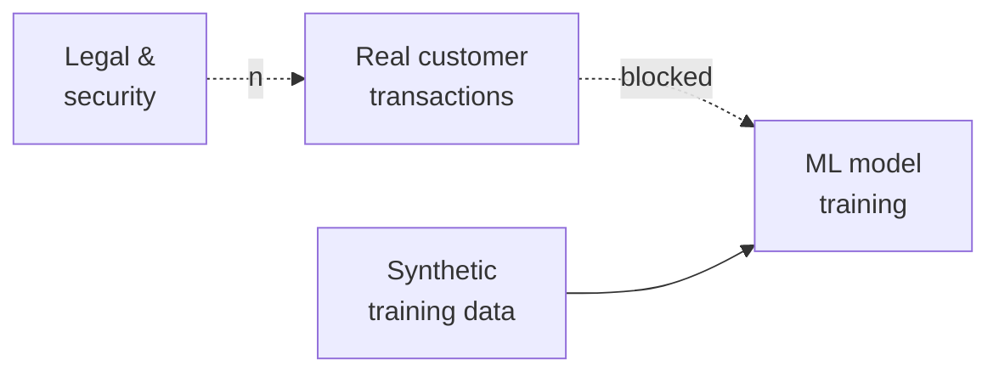

The problem started, like most good engineering problems, with something nobody wanted to touch.

We needed training data for several ML models we were building in the Data and Insights value stream at Vertex. Tax transaction data. Lots of it. The real stuff — the kind of data that, if it left the building in the wrong shape, would be a very bad day for a lot of people.

Legal said no to real customer data. Security said no to real customer data. The right answer was: no real customer data.

So we had a problem. You can't train a model on nothing. And synthetic data that doesn't behave like the real thing just teaches your model to recognize fake patterns.

_Figure: the data-access problem the patent addresses._

## What we actually built

Data Cake is a patent-pending service that removes the training-data bottleneck for tax ML — without any real customer data ever leaving its system of record. The patent is still pending, so I'm staying high-level. Happy to walk through the problem under NDA.

The point isn't the cleverness of the technique. The point is the outcome: ML projects at Vertex stopped being a regulatory negotiation. We moved from "is there a path to data?" to "what model do we want to train?" — which is the conversation engineers should be having in the first place.

## What surprised me building it

Two things.

First: the hardest part wasn't the ML. It was the domain. Tax is a heavily constrained world — jurisdictions, filing rules, industry boundaries, what's legally possible vs. what's merely plausible on paper. Getting the domain right took more work than getting the model right. As with most things, the constraints are the product.

Second: once it worked, the use cases exploded beyond what we originally intended. We built it for model training. It immediately became useful for:

- Safe demo data for customer pilots
- Load testing with realistic data distributions
- Onboarding new engineers who needed to work with production-shaped data without touching production
- QA environments that had previously been either too small to be meaningful or too real to be safe

That's the thing about solving a hard, real problem well — the solution tends to have more surface area than you planned for.

## On the patent process

Filing a patent as an engineer at a company is a strange experience. You write a lot of words that sound like English but aren't quite. You spend time explaining, in excruciating detail, why something that feels obvious to you isn't actually obvious. The bar for "non-obvious" in patent law is different from what engineers mean when we say something is clever.

It's worth doing. Not because patents are the point — they're not — but because the process of writing a patent application forces you to articulate your invention precisely enough that someone else could implement it. That's a clarifying exercise. I'd recommend it for any engineer who's built something genuinely novel.

Data Cake is pending. So are the other three. Watch this space.
