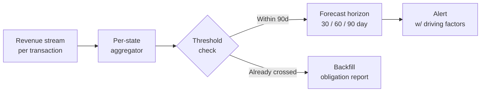

If you're not in tax technology, "nexus" might sound obscure. It isn't.

Nexus is the legal threshold that determines whether a business has sufficient presence in a state to owe sales tax there. Cross the threshold and you owe — retroactively, often with penalties.

After *South Dakota v. Wayfair* (2018), the Supreme Court expanded **economic nexus** to cover remote sales. Companies that never had a physical presence in a state suddenly discovered they'd been technically taxable there for years. Each state set its own threshold — typically $100K in revenue or 200 transactions per year ([here's the current state-by-state guide](https://www.salestaxinstitute.com/resources/economic-nexus-state-guide) from the Sales Tax Institute, if you want to see how spread out it is). Per-state exposure runs $100K–$500K.

The compliance machinery that exists to track this is mostly reactive. Tools watch your transaction volume by state and tell you when you're close to a threshold. That's defense with a short horizon.

The question that kept nagging me: **can you see it coming?**

## What the existing tools got wrong

Reactive monitoring works the way a smoke detector works. By the time it alarms, you already have a fire.

When a company crosses an economic nexus threshold, the obligation is immediate — but the discovery isn't. Most companies find out from a state notice arriving months after the crossing, with penalties and interest already attached. That gap between *event* and *discovery* is where the financial exposure lives.

The problem isn't visibility into current transactions. Companies have that. The problem is the **forward signal**. Whether you're going to cross the threshold in a given state isn't just a function of what you sold last month. It's a function of regional economic activity, your own growth trajectory by geography, seasonal patterns, and migration trends — things that lead the transaction volume by weeks.

If you can read the leading signals well enough, you can see the crossing coming.

## The architecture

_Figure: the prediction pipeline — raw revenue flows into per-state aggregators, the threshold check decides whether we forecast forward or backfill, and the forecast horizon feeds an alert that ranks the contributing signals._

Mort AI Nexus is a predictive model that forecasts threshold crossings on a state-by-state, horizon-by-horizon basis. The core inputs:

- The company's own transaction data (volume, geography, growth trajectory)
- Per-state threshold rules — there are 50+ different ones and they change
- Regional economic indicators (housing market activity, employment data, retail spending indices, migration patterns)
- Historical nexus crossings as labeled training data

The model outputs a probability of crossing each state's threshold within 30, 60, and 90 days, with the driving factors ranked by contribution. A compliance team using it sees: *"Texas is 87% likely to cross in 45 days, primarily driven by Q3 transaction acceleration in the Houston metro plus your overall ARR trajectory."*

That's a different conversation than the one tax teams have today. It's actionable. It happens in time to do something.

## On the regional signals

The signal that gets the most pushback is the **regional economic indicator** layer. The intuition isn't that we're predicting tax obligation directly from macroeconomics. We're using leading indicators of regional commercial activity as one input in a broader model.

Why does this matter? Economic nexus is fundamentally about commerce in a state. State-level commerce moves with state-level economic conditions. Cold winters in northern states correlate with suppressed spring transaction volumes. Severe weather events affect regional economic activity for weeks. Local employment shifts move retail spending. These signals lead the per-state transaction volume by enough time to be useful as a forecasting input.

We're not predicting nexus from the weather. We're using weather-correlated economic signals as one input alongside housing indices, employment data, migration patterns, and the company's own historical trajectory.

## What we measured

We tested the model against historical data first — backtesting against known nexus violations that had already occurred. It would have flagged 74% of them with a 45+ day warning window.

That's not perfect. But it's dramatically better than finding out after a state notice.

The bigger shift wasn't the accuracy number. It was the change in posture. Tax teams running Mort AI Nexus stopped scrambling to retroactively file and started planning ahead. Registration, calculation configuration, internal briefings — all of it could happen in time. The companies that adopted it shifted from defensive compliance to proactive compliance.

## What it's actually useful for

Beyond the prediction itself, the model's most valuable surface is **planning**.

Tax compliance teams now had 60–90 days of visibility into which states were likely to become nexus states. That's enough time to:

- Register with the state proactively
- Configure tax calculation in the right systems
- Brief finance, legal, and ops on the new obligation
- Avoid penalties entirely instead of scrambling to mitigate them

Instead of finding out from a state notice, they were finding out from the platform — weeks before the line.

That's the bar I think compliance tooling should aim for. Not "we'll tell you when you've broken the rule." Rather, "we'll tell you when you're going to."

---

*Mort AI Nexus is patent pending. Developed at Vertex Inc., 2025–2026.*
