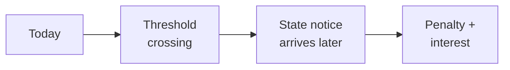

If you're not in tax technology, "nexus" might sound obscure. It isn't.

Nexus is the legal threshold that determines whether a business has sufficient presence in a state to owe sales tax there. Cross the threshold and you owe — retroactively, often with penalties.

After *South Dakota v. Wayfair* (2018), the Supreme Court expanded **economic nexus** to cover remote sales. Companies that never had a physical presence in a state suddenly discovered they'd been technically taxable there for years. Each state set its own threshold ([here's the current state-by-state guide](https://www.salestaxinstitute.com/resources/economic-nexus-state-guide) from the Sales Tax Institute, if you want to see how spread out it is). Per-state exposure runs $100K–$500K.

The compliance machinery that exists to track this is mostly reactive. Tools watch your transaction volume by state and tell you when you're close to a threshold. That's defense with a short horizon.

The question that kept nagging me: **can you see it coming?**

## What the existing tools got wrong

Reactive monitoring works the way a smoke detector works. By the time it alarms, you already have a fire.

When a company crosses an economic nexus threshold, the obligation is immediate — but the discovery isn't. Most companies find out from a state notice arriving months after the crossing, with penalties and interest already attached. That gap between *event* and *discovery* is where the financial exposure lives.

_Figure: the gap between crossing the line and finding out about it._

That gap is the problem worth solving.

## What Mort AI Nexus does

Mort AI Nexus is a patent-pending model aimed at shifting nexus compliance from reactive to proactive — closing the gap between event and discovery so tax teams aren't finding out from the state. The patent is still pending, so I'm staying off the mechanism. Happy to go deeper on the problem under NDA.

The bigger shift wasn't a single number. It was the change in posture. Tax teams stopped scrambling to retroactively file and started planning ahead. Registration, calculation configuration, internal briefings — all of it could happen in time. Companies that adopted it shifted from defensive compliance to proactive compliance.

That's the bar I think compliance tooling should aim for. Not "we'll tell you when you've broken the rule." Rather, "we'll tell you in time to not break it."

---

*Mort AI Nexus is patent pending. Developed at Vertex Inc., 2025–2026.*
