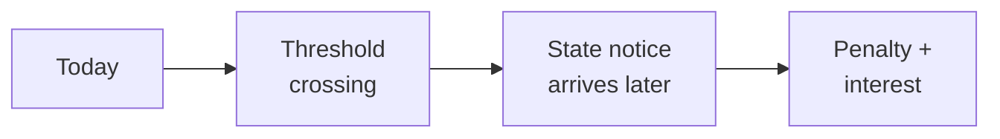

The letter shows up in February. State revenue department, certified mail. The company crossed an economic nexus threshold sometime last year, never registered, and now owes back tax plus penalties plus interest. Six figures, easy. Sometimes seven.

The tax director finds out the same week the CFO does.

After *South Dakota v. Wayfair* (2018), the Supreme Court expanded economic nexus to cover remote sales, and companies that never had a physical presence in a state suddenly discovered they'd been technically taxable there for years. Each state set its own threshold ([here's the current state-by-state guide](https://www.salestaxinstitute.com/resources/economic-nexus-state-guide) from the Sales Tax Institute, if you want to see how spread out it is). Per-state exposure runs $100K–$500K.

The compliance machinery that exists to handle this is mostly reactive. Tools watch your transaction volume by state and tell you when you're close. That's defense with a short horizon.

The question that kept nagging me: **can you see it coming?**

## Where the money actually leaks

When a company crosses an economic nexus threshold, the obligation is immediate. The discovery isn't. Most companies find out months later, from a state notice with penalties and interest already attached.

_Figure: the gap between crossing the line and finding out about it._

That gap — between the event and the discovery — is where the financial exposure lives. Close the gap and the exposure mostly goes away. Leave it open and you're paying for it in arrears.

## What Mort AI Nexus does

Mort AI Nexus is a patent-pending model that closes that gap, so tax teams aren't finding out from the state. I'm not going to walk through the mechanism here.

The interesting shift wasn't a single number. It was posture. Tax teams stopped scrambling to retroactively file and started planning ahead — registration, calculation configuration, internal briefings, all of it happening on a calendar instead of on a fire drill.

That's the bar I think compliance tooling should clear. Tell me before the state does.

---

*Mort AI Nexus is patent pending. Developed at Vertex Inc., 2025–2026.*
