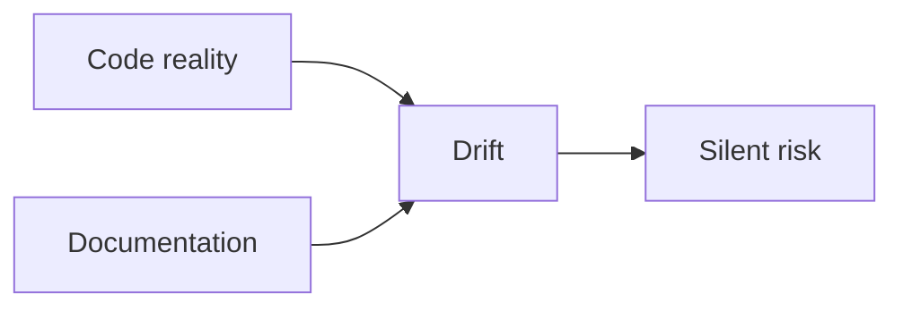

Every engineering team I've ever been on has the same lie. There's a README somewhere that describes what the system does. It was accurate once. Two sprints later, three engineers have pushed changes and nobody updated it, because nobody ever updates it.

Documentation rot isn't a discipline problem. It's a systems problem. And I got tired of it.

_Figure: code keeps moving; docs stop; drift accumulates as silent risk._

## What this actually looks like

At Vertex, we ran large, complex data pipelines in a regulated domain. We had docs — internal wikis, inline comments, decision records, README files. The docs were never wrong, exactly. They were *drifted*. Subtly out of sync in ways that were expensive to discover.

A new engineer would read the docs, build a mental model, and spend two days confused before someone older said "oh yeah, that changed about six months ago." The docs existed. You just couldn't trust them, and you didn't know which parts to distrust.

## What Doc Intel does

Doc Intel is my patent-pending take on the code/doc drift problem in regulated environments. The patent is still pending, so I'm staying off the mechanism.

The point wasn't a dashboard number. It was giving engineering teams a way to talk about documentation debt the same way they already talked about code coverage — quantifiable, tracked over time, brought up in PR review when it actually mattered.

## What teams did with it

Nobody had noticed the drift accumulating on the first pipelines we instrumented. The team was shipping. Velocity looked great. The docs had quietly fallen off a cliff and the one person who would have caught it was deep in a different program.

The first internal team to run Doc Intel had a senior engineer say "I had no idea it had gotten this bad." That's when I knew we'd built something real — when the people closest to the code were the ones surprised by the picture.

Back to work.

---

*Doc Intel is patent pending. Developed at Vertex Inc., 2025.*
