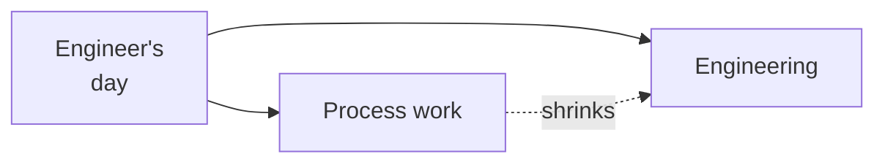

A few years ago I watched a TED talk that I haven't been able to stop thinking about.

[Margaret Heffernan: Forget the Pecking Order at Work](https://www.ted.com/talks/margaret_heffernan_forget_the_pecking_order_at_work).

The short version: researchers studied flocks of chickens to find what made the most productive ones. They identified the "super chickens" — the highest individual producers — and bred them together. Generation after generation of super chickens.

The result wasn't a super-productive super flock. Most of the chickens were dead. The super chickens had pecked the others to death.

She draws the parallel to corporate teams. The companies that stack their teams with the highest individual performers consistently underperform teams built for collaboration and mutual contribution.

_Figure: the time-reclamation bet — at the highest level._

I built Robby at Vertex because I believe she's right.

Robby is a patent-pending multi-agent system I invented in the Data and Insights value stream. The patent is pending and the substance stays there. The bet, at the highest level: AI can absorb enough of the engineering process overhead that humans get back to doing the engineering they signed up for.

I can't go deeper on the mechanism here. Reach out if it's relevant to what you're working on.

More soon.
