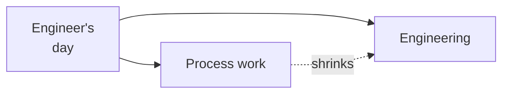

A few years ago I watched a TED talk that I haven't been able to stop thinking about.

[Margaret Heffernan: Forget the Pecking Order at Work](https://www.ted.com/talks/margaret_heffernan_forget_the_pecking_order_at_work).

The short version: researchers studied flocks of chickens to find what made the most productive ones. They identified the "super chickens" — the highest individual producers — and bred them together. Generation after generation of super chickens.

The result wasn't a super-productive super flock. Most of the chickens were dead. The super chickens had pecked the others to death.

She draws the parallel to corporate teams. The companies that stack their teams with the highest individual performers — the alphas, the dominators, the super chickens — consistently underperform teams built for collaboration, psychological safety, and mutual contribution.

_Figure: the time-reclamation bet — at the highest level._

I built Robby because I believe she's right.

Robby is a patent-pending multi-agent system I invented at Vertex. The patent is pending and the substance lives there. What I can say at a high level: the bet was that AI could absorb enough engineering process overhead — the docs, the handoff theater, the status work — that the humans get back to doing the engineering they signed up for.

The super chicken problem in software teams isn't just that the dominant engineers crowd out others. It's that the process overhead itself selects for the wrong things — the people who are good at playing the process game, not the people who are good at building software.

Robby is my answer to that. A direction, not a finished product. The bet is that an engineering team works best when every person spends their day on the part of the job that made them want to do this in the first place.

I can't go deeper on the mechanism here. Reach out if it's relevant to what you're working on.

More soon.
