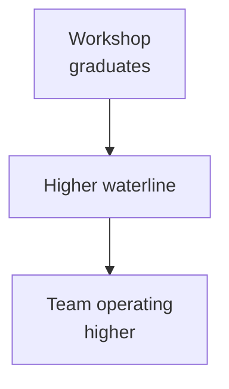

Four hours. No prior Python. The analyst sitting across from me had just shipped a working RAG tool that pre-drafted answers to our most common customer audit questions, over our internal knowledge base. She had never written a line of Python before that morning.

That was week two of the workshop. The moment I knew the curriculum worked.

By the time we wrapped two years in, 200+ employees across engineering, product, data science, and yes, finance had been through the **AI Curiosity Workshop** — internally called "Raise the Boats." About 50 came through the live cohort I taught directly. The rest worked through the curriculum I built around it. I learned more from running it than I expected.

_Figure: what "raise the boats" means in practice._

## The thing nobody told me about teaching AI

Most engineers I work with are smart. Like, genuinely sharp. But when I started the curriculum, I kept hitting the same wall: people understood what an LLM *was* in the abstract, and they couldn't picture what to actually *do* with one in the context of their day job.

That's not an intelligence problem. It's a framing problem.

The shift came when I stopped opening with "here's how transformers work" and started opening with: *what's the thing in your week that makes you want to throw your laptop?* Then we'd build something that fixed that. Small. Concrete. Theirs.

By week two, people were building real things. Like the analyst's RAG tool. Like a product manager who chained three tools together to triage a support backlog she'd been staring at for months. Like a data analyst who got tired of waiting on engineering and wrote her own first prompt template by Wednesday.

The barrier to building with agents isn't the framework. It's permission to imagine what you'd build if you had one.

## What works in production, what doesn't

We used crewAI and AutoGen heavily. Both are solid. I want to be honest about what I saw in real projects versus what the demos show you.

What works:

- Multi-agent pipelines for research and synthesis (summarize, validate, format)
- RAG over structured internal data — policies, audit histories, transaction logs
- Code review and doc-quality tooling

What doesn't, yet:

- Fully autonomous decisions on anything with financial consequence
- Agents that "just handle it" with no human-in-the-loop step somewhere
- Anything where the failure mode is silent

That last one is the one I hammer on hardest in every session. A traditional service throws a 500. An agent confidently gives you a wrong answer with excellent grammar. Those aren't the same failure mode and they don't get caught by the same monitoring.

## The unexpected win

The best outcome of the whole program wasn't the tools people built. It was the language.

After running it, teams started having different conversations. Instead of "we need a developer to build a script for this," it was "can we agent this?" Product managers were writing prompt templates. Data analysts were chaining tools together. The vocabulary changed, and with it, what felt possible.

That's what the name actually meant. Not that everyone becomes an ML engineer. That everyone's working at a higher waterline.

Back to work.
