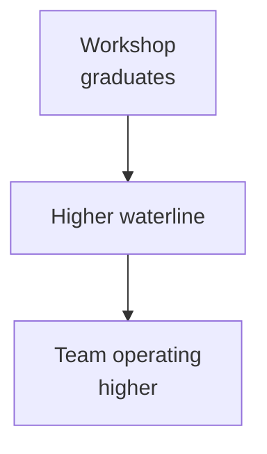

Four hours in, an analyst with no Python background shipped a working RAG tool over our internal audit knowledge base. It pre-drafted answers to the questions her team got asked most often. She had never written a line of Python before that morning.

That was week two. The moment I knew the curriculum worked.

By the time we wrapped, 200+ Vertex employees across engineering, product, data science, and finance had been through the **AI Curiosity Workshop** — internally called "Raise the Boats." About 50 came through the live cohort I taught. The rest worked through the curriculum around it.

_Figure: what "raise the boats" means in practice._

## Where the framing kept failing

Most of the engineers I worked with at Vertex are sharp. So I assumed the early sessions would land. They didn't. I opened with how transformers work, with token windows, with embeddings. People nodded politely and walked out unable to picture what they would actually *do* with one of these things on Monday morning.

The shift came when I rewrote the opener. Instead of starting with the machinery, I started by asking what each person hated about their week. The thing they avoided. The thing that made them want to throw their laptop.

Then we built something that handled that. The analyst's audit RAG was one of those. So was a product manager chaining three tools together to triage a support backlog she'd been staring at for months. So was the data analyst who got tired of waiting on engineering and shipped her own first prompt template by Wednesday.

The barrier isn't the framework. It's giving people permission to imagine.

## What I told them worked, and what didn't

We used crewAI and AutoGen heavily. Both are solid. The honest cut between what shipped to production and what looked great in a demo:

What works in production:

- Multi-agent pipelines for research and synthesis (summarize, validate, format)
- RAG over structured internal data — policies, audit histories, transaction logs
- Code review and doc-quality tooling

What doesn't, yet:

- Fully autonomous decisions on anything with financial consequence
- Agents that "just handle it" with no human-in-the-loop step somewhere
- Anything where the failure mode is silent

That last one is the bit I hammered on every session. A traditional service throws a 500. An agent confidently gives you a wrong answer with excellent grammar. Those aren't the same failure mode and they don't get caught by the same monitoring.

## The unexpected win

The best outcome wasn't the tools people built. It was the language.

Teams started having different conversations. Instead of "we need a developer to build a script for this," it was "can we agent this?" Product managers were writing prompt templates. Finance analysts were chaining tools together. The vocabulary changed, and what felt possible to ask for changed with it.

That's what the name actually meant. Not that everyone becomes an ML engineer. Everyone working at a higher waterline.

Back to work.
