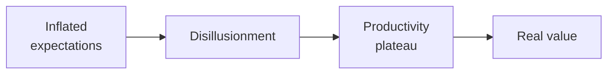

The last three years of my working life have been multi-agent systems in production. crewAI, AutoGen, LangChain, LangGraph — I've shipped against all of them, watched all of them break, and patched all of them at 11pm. Four patent-pending AI inventions came out of that stretch. I'm not standing in the way of the freight train.

I do want to talk about how fast it's actually moving, because the keynote version and the 11pm version are not the same conversation.

_Figure: agentic AI follows the curve — the value at the end is real; the timeline isn't._

## The capability is there

The foundation models are good. GPT-4-class models reason across multi-step problems, synthesize large document sets, write production code, chain tool calls in ways that would have looked like science fiction five years ago when I was still doing AWS Solutions Architect study cards on a Sunday morning. crewAI matured. AutoGen matured. LangGraph gives you proper state management for non-trivial flows, which the early versions absolutely did not.

If you want an agent that researches a topic, drafts a report, validates sources, and formats the output — that works today. Genuinely. I've watched a non-engineer at Vertex build a RAG over an audit knowledge base in four hours during a workshop I taught, and that workshop is part of why ~200 employees got trained on this stuff in two years. The capability floor has fallen far enough that the bottleneck is no longer "can the model do it." It's "do you know what to ask it to do."

## Where the production version diverges

The keynote demos show the agent *taking action* — submitting filings, modifying records, moving money. In tax, finance, and healthcare, you cannot let an agent autonomously do any of those without a verification layer in front of it. That isn't a capability gap, it's the legal and operational reality of regulated domains. Build for human-in-the-loop by default, not as the thing you bolt on after compliance asks.

Reliability is the second thing the demos don't show. A single agent call has maybe a 2–3% failure rate on a complex task — hallucination, tool error, context-window weirdness. Chain five and that compounds into something nobody wants to look at on a Monday. You need retry logic, fallback paths, observable failure states. The pretty demos have none of it, which is why they don't survive contact with a real workload.

Context windows are the third. Yes, they're huge now. Large context is not the same as *coherent* context. I've watched 128K-window models quietly forget early constraints around the 90K-token mark, with no warning and a confidence score that looks identical to the runs that didn't forget. Chunk and retrieve. Don't stuff the window and hope.

## The shape that holds up

Small agents with clear contracts. Not one big orchestrator trying to be everything — a pipeline of focused agents, each with one job, explicit inputs and outputs, and its own observability. Closer to microservices than monoliths. I've watched both shapes ship and only one of them is still running.

Prompts are code. Version them, test them, review them before they go to production. I've seen production incidents that traced back to a prompt edit nobody reviewed because it was "just text." Treat them like the load-bearing strings they are.

The companies that win this cycle won't be the ones with the most impressive demos. They'll be the ones who figured out how to run agents reliably, observably, and safely at the scale a real business needs. That's an engineering problem, and engineers who've been doing this for a few years right now have a real edge. I'd rather spend that edge building things that work than shipping a demo that hallucinates a tax filing.

More soon.
