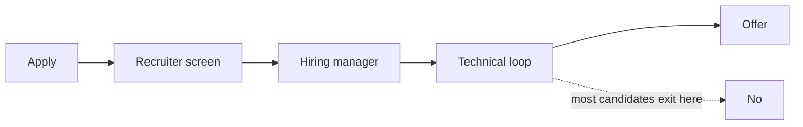

I'm between roles for the first time since 2022. Four years off this side of the table is a long time in tech, and the ground moved while I wasn't looking.

I'm a Principal Engineer with 25+ years of experience and four patent-pending AI inventions, and I'm still relearning how to do this. A few things from the first few weeks.

_Figure: the senior-engineer funnel — and where it actually filters._

## The ATS problem is worse than you think

I knew ATS (Applicant Tracking Systems) existed. I didn't appreciate how aggressively they filter until I started testing my own resume against job descriptions.

If your resume isn't formatted for machine parsing, a human may never read it. I rebuilt mine from scratch in LaTeX to get clean pdftotext output, and good thing. My original version had a font artifact: the small-caps rendering was mapping the letter 'I' in "Principal" to a lowercase glyph in the extracted text. ATS was reading "PRiNCiPAL ENGiNEER." Nobody told me. I caught it because I checked.

Run `pdftotext` on your resume and read what it outputs. That's what the system sees.

## The "AI will take your job" narrative is backwards for senior engineers right now

The engineers getting squeezed by AI are the ones who were doing work that was always a bit mechanical: boilerplate CRUD apps, basic data pipelines, junior ticket work. That's real, and I'm not dismissing it.

But for senior engineers who can architect a system, weigh the tradeoffs, and lead a team through an ambiguous problem, the demand is higher than I expected. Companies are building AI products faster than they can find people who know how to build them responsibly.

The principal and staff descriptions I'm seeing ask for multi-agent system design, LLM observability, and the reliability patterns that keep an AI transformation from blowing up in production. Narrow pool. I happen to be in it.

## The conversation that's changed

In 2022, most senior technical interviews were about system design: scale, tradeoffs, distributed systems. That's still there. Now there's an overlay.

*How would you AI-enable this?* shows up everywhere. Fine question. What's telling is how wildly the interviewers vary in their own understanding. Some are genuinely sophisticated. Some are fishing to see whether you'll bolt an LLM onto everything, which is the answer they're hoping you won't give.

So be honest about what AI is good at and where it falls down. The interviewers who matter respect that more than enthusiasm without nuance.

## What I'm looking for

I want to build something real. Not a proof-of-concept, not an "AI strategy" document, but a production system that solves a hard problem for people who need it solved.

I know tax, compliance, and fintech. I'm open to any technically hard problem where the stakes are real and the team is serious.

If that's you, [find me on LinkedIn](https://www.linkedin.com/in/dominick-campbell-70b3619b/).

More soon.
