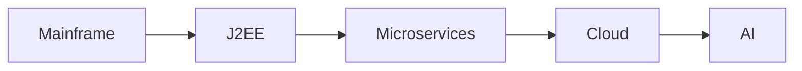

I started writing software professionally when `Y2K` was a genuine existential threat and COBOL was
a sensible career choice. I've since shipped systems in Java, JavaScript, Python, C#, COBOL,
and things I'd rather not admit to in polite company.

Nine jobs, mainframe to AI. A handful of things have held true across all of them. None of them are
in the architecture books.

_Figure: every era. Same fundamentals underneath._

## 1. The database outlives everything

You will rewrite the application 4 times. The schema you shipped in 2008 will still be there in
2026, quietly haunting every new engineer who joins the team. I've watched it happen on Oracle, on
DB2 over an IBM AS/400, on Postgres, on Snowflake. Different decade, same schema, different
application sitting on top of it.

Design the data model like it's permanent. It basically is.

## 2. Observability is a feature, not a tax

Every system I've seen fail catastrophically failed silently first. The tax close pipeline at
Vertex processing 50M–100M transactions a day didn't fall over loudly. It drifted for hours
before anyone noticed. In every case I can think of, the dashboards came after the outage, when
they should have come before the launch.

Build the dashboards before you build the features.

## 3. AI doesn't change the fundamentals, it raises the stakes

I hold 4 patent-pending AI inventions now. I've built LLM-backed audit defense tools, a synthetic
data generator, and a multi-agent SDLC system. The most important thing I've learned from any of it:

**AI doesn't eliminate the need for good system design. It punishes bad system design faster.**
{: .notice--info}

A traditional service with a weak design degrades. An AI service with a weak design starts inventing
answers, and it sounds confident doing it.

## 4. The best engineers I've met are fundamentally teachers

At Vertex I built and delivered the "Raise the Boats" curriculum: 200+ engineers and analysts
through the program, ~50 through the live cohort I taught myself. The engineers who treated
teaching as overhead were the same ones whose systems left with them when they left the company.

## 5. Every great product I've shipped had a clear owner

HRCommand at Connect Your Care drove the Optum acquisition because one architect owned the
EJB-to-Spring-Boot decomposition and one team knew who was making the calls. The voice biometric
fraud system at JPMC hit 10 million accounts in three months with 1,300 opt-outs because someone
took the heat for the design and stayed with it. Committees come later, after the thing already
works.

---

Twenty-five years and the lessons keep coming from the same place: the data, the boring dashboards,
the person who owns the thing. If any of this lands, find me on
[LinkedIn](https://www.linkedin.com/in/dominick-campbell-70b3619b/) or
[GitHub](https://github.com/ethos71).

More soon.
