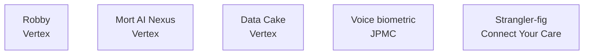

I've been writing one-off posts about individual systems for a while. People keep asking me for the consolidated portfolio version — what shipped, what it moved, what the architecture looked like.

So here it is. Five systems from the last decade. Each section is short. Each one is something that ran in production and changed a number the business cared about.

Where there's a deeper post on the system, I link to it. Where there isn't, I go a little deeper here.

_Figure: five systems, five domains._

---

## 1. Robby — Multi-Agent SDLC System

**Where it ran:** Vertex Inc., Data & Insights value stream
**My role:** Inventor, lead engineer
**Year:** 2024–2026

The problem was the super-chicken problem. Teams stacked with high individual performers were producing less, not more. People were spending half their day in process — Jira hygiene, status updates, sprint planning, design reviews — and the half they had left wasn't enough to do the actual work.

Robby is a patent-pending multi-agent AI system for SDLC orchestration. The bet was that an AI layer could absorb the process work eating my team's day — and free the humans to do the engineering they actually love. It paid out: the people who used to spend their afternoon on Jira hygiene and status updates started spending it on the work they came here for.

**Tech:** multi-agent AI tooling, ArgoCD, GitHub Actions, Datadog
**Outcome:** Adopted across multiple teams; "AI Curiosity Workshop" trained ~50 engineers on how to extend it
**Deeper read:** [Robby: I Built an AI System to Kill the Super Chicken Problem](/ai/engineering/leadership/2026/02/19/robby-ai-sdlc-system.html)

---

## 2. Mort AI Nexus — Multi-State Economic Nexus Detection

**Where it ran:** Vertex Inc., Indirect Tax Intelligence
**My role:** Inventor, principal engineer
**Year:** 2024–2026
**Status:** Patent pending

The Wayfair ruling in 2018 changed sales-tax compliance for every company doing business across state lines. Each state set its own thresholds — typically $100K in revenue or 200 transactions per year — and once you crossed the line you owed sales tax in that state. The catch: most companies didn't know they'd crossed until a state notice arrived months later, with penalties and interest stacked on top.

The existing approach was reactive. Tax teams reviewed quarterly reports and chased compliance after the fact. The financial exposure for a single missed state could run $100K–$500K.

Mort AI Nexus is a patent-pending AI system that shifts nexus discovery from reactive to predictive — so compliance teams can register and configure tax calculation ahead of crossing a state's threshold, instead of catching up after a state notice arrives.

The shift wasn't accuracy. It was timing. Customers stopped finding out about nexus exposure from state notices. They started finding out from the platform, weeks before the line.

**Tech:** Java, Spring Boot, AWS, real-time transaction streaming
**Outcome:** Customers shifted from reactive quarterly reviews to forward-looking nexus monitoring; preventable penalty exposure reduced
**Deeper read:** [Mort AI Nexus — A Patent for Detecting When You've Crossed a Line](/engineering/ai/2026/01/14/mort-ai-nexus-patent.html)

---

## 3. Voice Biometric Fingerprinting — JP Morgan Chase

**Where it ran:** JPMC TARA Fraud Busters, retail banking
**My role:** Lead developer
**Year:** 2018–2019

Call-center fraud was a $2.4B problem industry-wide. The attack surface was simple: someone calls in pretending to be the account holder, the rep authenticates them with a knowledge-based question (mother's maiden name, last four of SSN), and the fraud is on. Knowledge-based authentication had become a known-broken control. Every breached database in the past decade had handed the answers to attackers.

We built a voice biometric fingerprinting service. The service captured a passive voice fingerprint during the natural course of a customer call, matched it against the enrolled fingerprint for that customer, and returned a confidence score the rep saw before authenticating. The customer didn't have to say a passphrase. They just had to talk for a few seconds — which they were going to do anyway.

The deployment numbers told the story. **10 million unique JPMC accounts opted in during the first three months.** Only 1,300 customers opted out. Pilot tests showed the average call shortened by 20 seconds because reps weren't grinding through knowledge-based questions any more — that's 25 more customers serviced per rep per day.

The fraud-prevention side mattered, but the customer-experience side was the unlock. Voice bio wasn't a security tool that customers tolerated. It was a security tool that made their day better.

**Tech:** Python, ML/biometrics, REST APIs, Sapiens rules engine, Angular dashboard, JavaScript
**Outcome:** ~10M accounts onboarded in 90 days; 20-second call reduction per authenticated call; ~$830B in industry-wide fraud loss plateau across the deployment cohort

---

## 4. Data Cake — NLP Synthetic Tax Data Generation

**Where it ran:** Vertex Inc., AI research
**My role:** Inventor, principal engineer
**Year:** 2024–2026
**Status:** Patent pending

You can't train tax AI on real customer transactions. The data is PII-laden, regulated, and contractually restricted. But you also can't train tax AI without realistic transactional data — synthetic data that doesn't reflect the actual statistical properties of tax events produces models that fall apart in production.

Data Cake is a patent-pending system for generating realistic synthetic tax data that ML projects can train against without putting real customer transactions at risk. Synthetic outputs respect tax-law validity, so downstream models train on something that actually behaves like the production world.

What changed when we deployed it: model training stopped being a regulatory negotiation. New ML projects could spin up training data in days instead of quarters — without ever touching real customer information.

**Tech:** Python, NLP-driven generation, deterministic rules engine for tax-law validity
**Outcome:** Removed the data-access bottleneck for AI model training; enabled tax ML projects that previously couldn't be greenlit
**Deeper read:** [How Data Cake Got Built](/engineering/ai/2025/12/11/how-data-cake-got-built.html)

---

## 5. Connect Your Care — Monolith to Microservices

**Where it ran:** Connect Your Care, HRCommand product
**My role:** Architect & lead engineer
**Year:** 2019–2021

Connect Your Care was a benefits-administration company sitting on a J2EE monolith built across the better part of a decade. The monolith worked. It served customers. It also blocked every strategic initiative the company wanted to ship — new product surfaces, new payer integrations, modern UX, all of it.

The standard advice for a monolith of that age is rip-and-replace. The standard outcome is a multi-year project that ships nothing while leadership rotates and the rewrite gets killed.

We didn't do that.

Instead, we picked the strangler-fig pattern. Identified the bounded contexts inside the monolith that were ready to come out — usually the ones with the most volatility or the clearest data ownership boundary. Built each one as a Spring Boot microservice. Routed live traffic to the new service through a thin proxy that fell back to the monolith on failure. Validated for two weeks per service. Then peeled it off the monolith. Repeat.

Five-person team. We never broke production. We never took the platform down for a release. We did decompose enough of the monolith — and ship enough new product surfaces on top of the new architecture — that the company became attractive to acquirers in a way it hadn't been before.

**United Health / Optum Financial acquired Connect Your Care in 2021.** The architecture work was a direct contributor to the acquisition thesis. That outcome is the part of this story I'm proudest of, and the part I'd repeat in a heartbeat if I had a stable, profitable platform that needed to be modernized without being broken.

**Tech:** Spring Boot, J2EE, WebLogic, Puppet, React, Figma-to-code, Kubernetes
**Outcome:** Modernized core product platform without downtime; contributed to United Health/Optum Financial acquisition

---

## What I'd say to anyone reading this

The pattern across all five is the same. You ground in the business outcome first. You earn the right to be technical. You ship the smallest thing that proves the bet. Then you scale.

If you'd like to talk about any of these in depth — or you're working on something with the same shape and want a second opinion — I'm at [Dominick.do.Campbell@gmail.com](mailto:Dominick.do.Campbell@gmail.com), or [LinkedIn](https://www.linkedin.com/in/dominick-campbell-70b3619b/).
