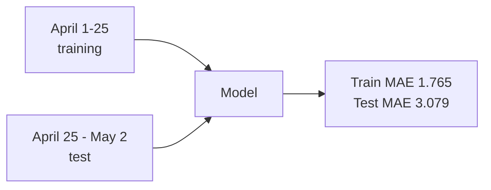

The most useful number in this model is the gap between two other numbers.

**Training MAE: 1.765 fantasy points. Test MAE: 3.079 fantasy points.**

If you've done any ML in production you know what that gap means. The model fits its training data tighter than it fits the world. It's overfit. Some level of overfitting is almost always happening; the question is whether you measured it and can say out loud why it's there.

Most of the production "AI" I've seen in the wild can't.

_Figure: the train/test split that exposed the honest gap._

## What I built

A daily player-performance predictor for fantasy baseball — my side project, [github.com/ethos71/fantasy-baseball-ai](https://github.com/ethos71/fantasy-baseball-ai). XGBoost regression, Streamlit UI on top. Target is how many fantasy points a given MLB batter scores the next day, standard rotisserie scoring, about 150 batters in play on any given slate.

Training data was 2,300+ real game logs from April 2026, engineered into ten features per player-day. Rolling averages at 5, 10, and 20 games. Standard deviations across the same windows. Trend deltas. Binary flags for hot streaks and cold streaks.

Ten features. Hand-crafted. Domain-informed. That part matters more than which gradient-boosted library you reached for.

## Why XGBoost

I'm not religious about it. I picked it for boring reasons. Mixed feature types without preprocessing gymnastics. 200 trees train in seconds on a laptop. Feature importance falls out of the model for free. And when a friend in my league asks "why six points?", I can answer in English instead of waving at gradients.

A neural network wouldn't have helped here. 4,800 samples isn't enough to make a deep architecture stable, and "the gradients converged" isn't an answer that survives a Sunday-morning text thread, let alone a stakeholder room.

## The validation choice

Most fantasy-sports ML projects random-split their data. Random splits look great in notebooks and lie about reality. If a model trains on May 15 data and tests on April 20 data, you've leaked the future into the past. The reported accuracy is fiction.

So I did temporal validation. **Train on April 1–25. Test on April 25–May 2.** No shuffling. The test set is strictly later than the training set, the way the model would have to operate if I deployed it. That's the choice that produced the gap. A random split would have buried it.

## What the honest number means

Train MAE 1.765 says the model learned the patterns in the April window. Test MAE 3.079 says they don't fully generalize a week forward. The reason is in the features. Mine are all about *the batter* — nothing about who he's facing, weather, ballpark, rest, lineup spot. A hot hitter against a Triple-A call-up is a different distribution from a hot hitter against an ace, and the model has no way to tell them apart.

About 40% of predictions land within ±2 FP, useful for relative ranking. The worst errors are 15+ FP and they cluster in exactly the games my features can't see — a slumping batter detonates against a rookie spot-starter, of course the model missed it.

80% of ML accuracy comes from the domain features. Most projects invert that ratio and wonder why the pipeline doesn't get better in production.

## What I'd ship

I wouldn't ship this as autonomous predictions. Not yet. What I'd ship is the model as a tool an analyst uses — paired with Vegas lines, FanGraphs projections, and somebody who knows Ohtani isn't on waivers no matter what the database says.

Next iteration adds opponent ERA/OPS-allowed, pitcher handedness, and rest days. That should close the gap and beat the FanGraphs baseline this version underperforms by about 10%. Then weekly retrains and drift monitoring against the baseline.

I've sat in too many rooms where someone presented a 99% accurate model that was 99% leaked. The hard part of production ML isn't moving the metric. It's knowing what the model doesn't know, and being willing to put that gap on the slide.

The model doesn't know who's pitching tomorrow. I do. That's the partnership.

More soon.
