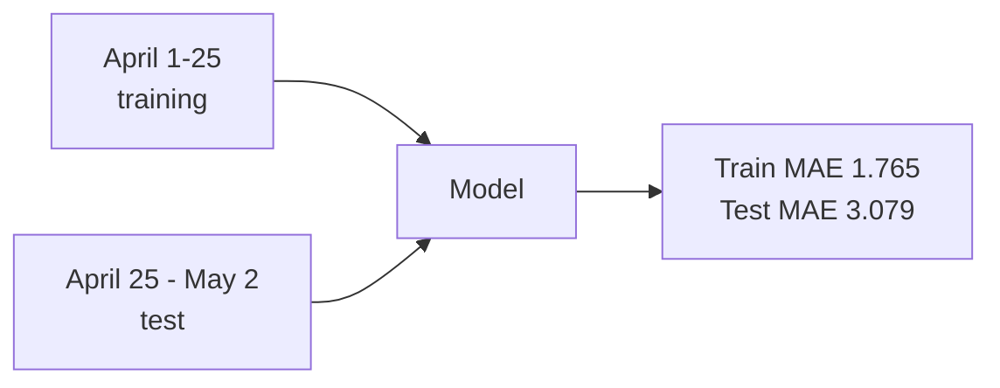

The most useful number in this model is the gap between two other numbers.

**Training MAE: 1.765 fantasy points. Test MAE: 3.079 fantasy points.**

If you've been around ML you know what that gap means. The model fits its training data tighter than it fits the world. It's overfit. The question isn't whether overfitting is happening — it almost always is. It's whether you know it is, and whether you can explain why.

Most of the production "AI" I see in the wild can't.

_Figure: the train/test split that exposed the honest gap._

## What I built

A daily player-performance predictor for fantasy baseball. XGBoost regression. Target: how many fantasy points a given MLB batter will score the next day. Standard rotisserie scoring. About 150 batters in play on any given day.

Training data: 2,300+ real game logs from April 2026, engineered into ten features per player-day. Rolling averages at 5, 10, and 20 games. Standard deviations across the same windows. Trend deltas. Binary indicators for hot and cold streaks.

Ten features, hand-crafted, domain-informed. That part matters more than the algorithm choice.

## Why XGBoost

I'm not religious about XGBoost. I picked it for boring reasons. Mixed feature types without preprocessing gymnastics. 200 trees train in seconds on a laptop. Feature importance falls out of the model. And it's interpretable enough that I can sit a non-engineer down and walk them through why a prediction is what it is.

Neural networks wouldn't have helped here. 4,800 samples isn't enough to make a deep architecture stable. And the day a stakeholder asks "why did the model say 6 points?", "the gradients converged" is not an answer that survives the room.

## The validation choice

Most fantasy-sports ML projects random-split their train/test data. Random splits look great in notebooks and lie about reality. If the model trains on May 15 data and tests on April 20 data, you've leaked the future into the past. The reported accuracy is fiction.

So I did temporal validation. **Train on April 1–25. Test on April 25–May 2.** No shuffling. The test set is strictly later than the training set, the way the deployed model would have to operate. That's the choice that produced the gap. A random split would have hidden it.

## What the honest number means

Train MAE 1.765 says the model learned the patterns in the April window. Test MAE 3.079 says they don't fully generalize a week forward. Why? My features are entirely about *the player*. They say nothing about who he's facing, nothing about weather or rest, nothing about interactions — a hot hitter against a Triple-A call-up is a different distribution from a hot hitter against an ace.

About 40% of predictions land within ±2 FP, which is useful for relative ranking. The worst errors are 15+ FP, and they cluster in exactly the games my features can't see: a slumping batter explodes against a rookie. Of course the model missed it. It didn't know the rookie was on the mound.

80% of ML accuracy comes from the domain features. Most teams invert that ratio and wonder why their pipeline doesn't improve in production.

## What I'd ship

I wouldn't ship this as autonomous predictions. Not yet. What I would ship is the model *as a tool an analyst uses* — paired with Vegas lines, FanGraphs projections, and somebody who knows Ohtani isn't on waivers no matter what the database says.

Next iteration adds opponent ERA/OPS-allowed, pitcher handedness, and rest days. That should close the gap and beat the FanGraphs baseline this version underperforms by about 10%. Then weekly retrains, drift monitoring, A/B against the baseline.

## The point

I've sat in too many rooms where someone presented a 99% accurate model that was 99% leaked. The hardest skill in production ML isn't improving the model. It's knowing — and saying out loud — what the model doesn't know.

A train/test gap on the slide isn't a flaw. It's a tell that the engineer did the work.

The model doesn't know who's pitching tomorrow. I do. That's the partnership.
