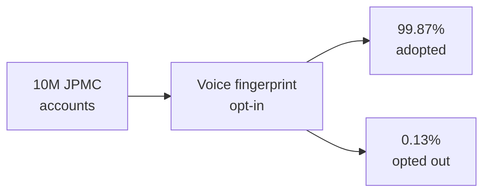

The number I think about from this project is 1,300.

That's how many JPMorgan Chase customers opted out of voice biometric authentication during the first three months. **Ten million accounts in. 1,300 out. A 99.87% adoption rate** on a security feature.

I've shipped a lot of systems in 25 years and that's the highest voluntary adoption I've ever seen on anything touching account security. The headline metric is the ~$830B in fraud losses prevented across the JPMC consumer banking cohort, and that's the one that gets quoted. The 99.87% is the one I think about, because we didn't get there by being clever about the security model.

_Figure: opt-in adoption that didn't look like opt-in adoption._

## What we were trying to solve

I was an Infrastructure Developer at JPMC's Wilmington office from February 2018 to February 2019, embedded with the TARA Fraud Busters group. The problem was call-center fraud. Attacker calls in pretending to be the account holder. Rep authenticates with knowledge-based questions — mother's maiden name, last four of social, last transaction amount. Every one of those answers was sitting in a breached database somewhere on the open web. Rep authenticates the attacker, fraud goes through.

Knowledge-based authentication was finished. The fraud team knew it. What nobody had was a clean replacement that customers would actually adopt.

## Why we didn't ship a passphrase

The default fix in the literature is a voice passphrase. Customer enrolls a phrase, says it on every call, system matches the voiceprint. It works as a security control. As a customer experience it's a slow disaster — fifteen seconds on every call, a confusion vector when people forget the phrase, and an explicit opt-in moment where the customer has to choose to enroll. That moment is where security features die.

So we asked a different question: what if enrollment is the call they were already making?

## What we built

Passive voice biometric fingerprinting, Python and ML on the matcher side. Customer calls about a disputed charge, a lost card, a balance question, whatever. The system captures a fingerprint silently during the natural conversation. Thirty seconds of normal call and a voiceprint accumulates in the background.

On the next call, the system matches the new voice against the enrolled one and surfaces a confidence score before the rep starts knowledge questions. High confidence — skip them, authenticate immediately. Low confidence — fall back to the old flow plus extra fraud checks. We fed all of it into the JPMC CAT tool, an Angular dashboard pulling aggregated REST APIs across the fraud surface, with a Sapiens rules engine applying policy in real time.

The customer never saw any of this. They just noticed their calls went faster.

## The hard parts

Voiceprint matching itself was the easy part — mature libraries exist. The work was in the parts around it.

1. **The capture pipeline.** Call-center audio is not studio audio. Mid-call noise, multiple speakers, partial captures. Every fingerprint carried a quality score and the matcher gated on it.
2. **The opt-out path.** One sentence, on the call, no forms. "I'd rather you didn't use voice on my account" — done, flag flipped, respected on every subsequent call. **The 1,300 customers who opted out used this path.**
3. **The fraud-ops feedback loop.** Rep flags went straight into the training set. Model got better every week.

## The numbers

Three months in: 10,000,000 accounts enrolled passively, no opt-in click. 1,300 opt-outs — the number that proved the opt-out path actually worked. Twenty seconds off the average authenticated call, which at call-center scale translated to roughly 25 more customers per rep per day. The post-deployment analysis pegged the fraud-loss plateau across JPMC consumer banking at ~$830B prevented.

## What I'd tell someone building the next one

Security features get treated as if customer experience is a tax you pay for safety. Frame the problem that way and you get small-percentage adoption and a postmortem.

Flip it. Build the security feature so the customer's life gets *better* at the moment it engages. 99.87% is what happens when you frame the design problem correctly.

Back to work.
