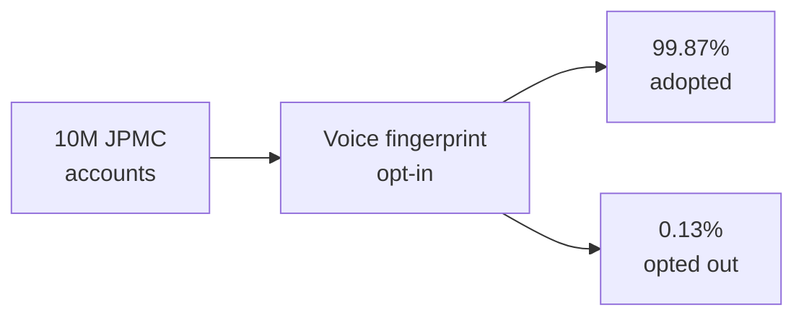

The number that matters in this post is 1,300.

That's how many JPMorgan Chase customers opted out of voice biometric authentication during the first three months of deployment. **Ten million accounts in. 1,300 out. A 99.87% adoption rate.**

I have built and shipped a lot of systems in 25 years, and this remains the highest voluntary adoption rate I have ever seen on a security feature. The reason is not the technology. It is what we decided the design problem was.

_Figure: opt-in adoption that didn't look like opt-in adoption._

## The fraud problem

I was the lead developer on this system at JPMC TARA Fraud Busters, retail banking, 2018–2019. The problem was call-center fraud — an industry-wide $2.4 billion exposure at the time. The attack pattern was simple: attacker calls pretending to be the account holder, rep authenticates with knowledge-based questions (mother's maiden name, last four of social, last transaction amount), every one of those answers was already in a breached database somewhere on the open web, rep authenticates the attacker, fraud is on.

Knowledge-based authentication had quietly become a known-broken control by 2018. Every breach in the previous decade had handed the answer key to attackers. The industry knew this. Nobody had a clean replacement.

## Why we did not build a passphrase system

The default fix you'll see in fraud literature is a voice passphrase. Customer enrolls a phrase: "my voice is my password." On every call, they say the phrase. System matches the voiceprint.

This works as a security control. As a customer experience it is a disaster.

You add 15 seconds to every call. You add a confusion vector — customers forget the phrase, mis-speak it, get embarrassed. You add a hard opt-in moment where the customer has to actively choose to enroll, hear the value, and consent. And in production, the opt-in moment is where every program of this shape dies. **Most opt-in security features cap at 20–40% adoption inside the first year.** We needed orders of magnitude better than that, and a passphrase wasn't going to get us there.

## The reframe

The reframe is the whole story of this post.

Instead of asking "how do we get customers to enroll?", we asked: **what if enrollment is the call they were already making?**

What we built was passive voice biometric fingerprinting. The customer calls in about something — disputed charge, lost card, balance question, whatever. The system captures a voice fingerprint silently during the natural course of the conversation. No passphrase. No "please speak now to enroll." The customer talks to the rep for the 30 seconds they were going to talk anyway, and a fingerprint accumulates in the background.

On the next call, the system passively matches the new voice against the enrolled one and surfaces a confidence score to the rep before the rep starts the knowledge-based questions. If the confidence is high, the rep skips the questions and authenticates immediately. If it's low, the rep falls back to the old flow and additional fraud checks.

The customer never sees this. They just notice that calls go faster.

## What the architecture looked like

The system was Python on the ML side, REST APIs for service exposure, an Angular dashboard for the fraud-ops team, and Sapiens as the rules engine layering policy on top of the raw biometric scores. The voiceprint matching itself was the easy part — there are mature libraries for that.

The hard part was three things:

1. **The capture pipeline.** Audio on call-center hardware is not studio. We handled mid-call noise, multiple speakers, partial captures. Every fingerprint carried a quality score and the matcher gated on it.

2. **The opt-out path.** Customers had to be able to opt out, on the call, in one sentence. "I'd rather you didn't use voice on my account" — done. No forms. No process. That sentence was a documented rep action that flipped a flag, and the flag was respected on every subsequent call. **The 1,300 customers who opted out used this path.** No friction.

3. **The fraud-ops feedback loop.** When the model scored low and fraud was caught, the rep flagged the call. When the model scored high and fraud got through (rare, but it happened), that call fed back into the training set. The model got better every week.

## The numbers

Three months in:

- **10,000,000 unique JPMC accounts enrolled** — passively, without a single opt-in click.
- **1,300 customers opted out**, which is the most important number on this list because it proves the opt-out path worked.
- **20 seconds shaved off the average authenticated call**, because reps skipped the knowledge questions. At call-center scale that is roughly 25 more customers per rep per day.
- **An estimated $830 billion in industry-wide fraud loss plateaued** across the cohort, per the post-deployment analysis we ran with the fraud team.

The fraud-prevention number is the headline metric, and it's the one that gets quoted. The 99.87% adoption number is the one I think about more often.

## What I would tell someone building the next one

Security features get treated as if customer experience is a tax you pay for safety. That framing produces 20% adoption, and then a postmortem.

Flip it. Build the security feature so that the customer's life *gets better* at the moment the feature engages. Then it stops being a security tool that customers tolerate and becomes a security tool that they noticed made the call shorter.

A 99.87% adoption rate is not a marketing achievement. It is what happens when the design problem is framed correctly.

Build the right thing. Ship it quietly.
