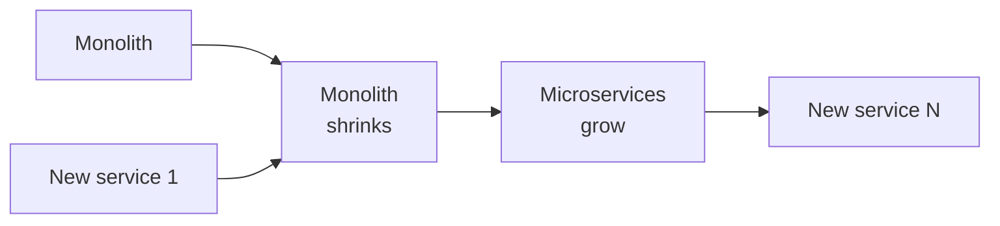

There's a class of advice I've watched destroy more value than almost any other in enterprise software. It usually arrives early in a leadership transition. It sounds confident. And it goes like this:

> "The monolith is the problem. We need to do a full rewrite."

I've sat in this meeting at five companies. Four of those rewrites either shipped late, shipped broken, or never shipped at all. The fifth — Connect Your Care, 2019 to 2021 — shipped, modernized a J2EE/EJB platform a decade in the making, never broke production, and helped drive an acquisition by UnitedHealth/Optum Financial.

The difference wasn't talent. It wasn't budget. It was that we didn't do a rewrite. We used the **strangler fig** pattern, and we ran it with discipline.

This post is about that pattern and why it works.

_Figure: the strangler-fig pattern — new grows around old as old shrinks._

## Why rip-and-replace fails

A monolith that's been in production for a decade isn't a code problem. It's a *running business* with integration contracts, regulatory commitments, billing flows, and undocumented behavior the customer support team has been quietly accommodating for years.

When you announce a rewrite, three things happen at once:

1. **The team stops shipping features in the old system** because nobody wants to add code to "the legacy." Roadmap velocity drops to zero.
2. **The new system has to recreate every undocumented behavior** the monolith accumulated — and you only discover them when a customer escalates that something stopped working.
3. **The strategic window closes** before the rewrite finishes. Leadership rotates. The rewrite gets killed at 60%.

Then you have a half-built parallel system and a monolith you never improved. This is not a hypothetical. I've watched it happen.

## The strangler fig

The pattern is named after a real plant. The strangler fig germinates in the canopy of a host tree, sends roots down around it, and grows into a complete structure over years. By the time the host decays, the fig is already a tree. There was never a cutover.

In software, the pattern looks like this:

1. **Put a thin proxy in front of the monolith.** Every request goes through it. Day one, the proxy adds zero functional behavior — it's the trellis.
2. **Pick the smallest bounded context** ready to come out. Usually the one with the clearest data ownership boundary or the one where the team is in the most pain.
3. **Build that bounded context as a new service** — in our case Spring Boot. Its own datastore if it can carry one, otherwise read-through the monolith's database initially.
4. **Route live traffic to the new service** behind a feature flag — per endpoint, not per customer.
5. **Watch metrics for two weeks.** Error rates, latency, business KPIs. If anything moves wrong, the flag flips back to the monolith path in seconds.
6. **Peel the bounded context off the monolith.** Delete the old code path. Repeat.

No twelve-month roadmap. Just a two-week loop, run until the monolith is small enough to retire or quiet enough to leave alone.

## The discipline that makes it work

The pattern is simple. The discipline is the part teams skip. Five things that matter:

**Pattern over plan.** You do not commit upfront to which bounded contexts will move in which order. You commit to the loop. The order emerges from where the pain is and what's ready.

**Anti-corruption layer at every boundary.** The new service does not adopt the monolith's data model. It defines its own clean model and translates at the seam. The translation lives in one file. When the monolith changes shape — and it will — one file changes.

**Idempotency keys on every write that crosses the seam.** During the migration the same request will sometimes get retried across the proxy. Without idempotency you create duplicate financial records and a very bad week.

**Outbox pattern for events.** When the new service has to notify the monolith (or vice versa) of a state change, you write the event to an outbox table in the same transaction as the state change. A separate process drains the outbox. You never lose an event. You never publish one that didn't happen.

**Feature flags per endpoint, not per release.** Releases are huge and scary. A single endpoint behind a flag is a 30-second rollback. The blast radius is one capability for one cohort for one window of time. You learn fast and the worst case is small.

These are not exotic ideas. They are widely documented. The reason teams skip them is that none of them feel like progress on the new system — they feel like overhead. Every one of them is the thing that lets you sleep at night during a multi-year migration.

## What it looked like in practice

At Connect Your Care, five-person team. J2EE/EJB monolith on WebLogic, Puppet-managed infrastructure, a React surface eventually replacing the older UI. We never had a cutover weekend. We never took the platform down for a release. We shipped new product surfaces on the new architecture while peeling capability off the old.

When UnitedHealth/Optum Financial acquired the company in 2021, the modernized architecture was a direct contributor to the acquisition thesis. That outcome is the one I'm proudest of in 25 years of building systems — not because the technology was novel, but because we did the boring disciplined thing for two years straight and it compounded.

## When not to do this

One case where I'd entertain a rewrite: the monolith genuinely cannot scale and the runway to rebuild is funded. That case is rarer than people think. Most monoliths that "can't scale" can scale fine with two months of focused work on the three hot paths. Test that hypothesis before you commit to a multi-year rewrite.

If you take one thing from this post: **the modernization is not the rewrite. The modernization is the operating discipline.** The pattern is a vehicle for that discipline. Without the discipline, the pattern does nothing.

Modernize the system. Don't break the company.
