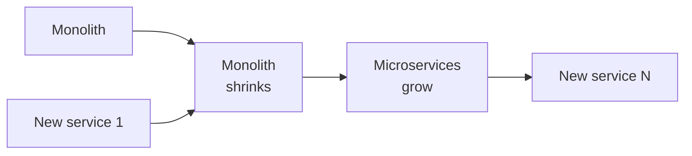

I joined Connect Your Care in Hunt Valley in May of 2019. HRCommand — the flagship — was a J2EE/EJB monolith running on WebLogic, ten years of consumer HR product baked into it. The brief was straightforward: modernize it, don't break it, and ship enough new product surface that a strategic acquirer would care.

Twenty-three months later UnitedHealth/Optum Financial acquired the company, and the modernized HRCommand architecture was sitting on the table in the due-diligence room. We never did a cutover weekend. We never had a release outage. Five engineers, two-week loop, two years.

We didn't rewrite it. We ran the **strangler fig** pattern, and we ran it boring.

_Figure: the strangler-fig pattern — new grows around old as old shrinks._

## Why I won't sign up for a full rewrite

I've sat in the meeting at five companies now. New VP, new deck, same line: the monolith is the problem, we need a full rewrite. Four of those rewrites shipped late, shipped broken, or got killed at 60% with a half-built parallel system and a monolith nobody had improved.

A decade-old monolith is not a code problem. It's a *running business* — integration contracts, regulatory commitments, a long list of undocumented behaviors that customer support has been quietly accommodating for years. The day you announce the rewrite, the old team stops shipping. The new team rediscovers undocumented behavior the hard way. Leadership rotates. The Q4 board deck reads differently than the Q1 one. None of that is exotic. It happens every time.

## What we did at CYC

Thin proxy in front of HRCommand. Day one, zero new behavior. Pick the smallest bounded context with a clean data-ownership boundary — for us, that was a benefit-eligibility surface nobody wanted to touch. Build it as a Spring Boot service. Route traffic behind a per-endpoint feature flag. Watch error rates and the business KPIs that actually mattered for two weeks. If anything moved wrong, the flag flipped back in seconds. Peel the old code path out. Pick the next.

In parallel, the UI rebuilt itself the same way — React replacing the old JSP screens slice by slice, Figma-to-code components landing in a shared library that the rest of the consumer-facing product line eventually adopted.

## The boring parts that decide whether it works

The pattern is simple. The discipline is the part teams skip, because it doesn't feel like progress on the new system:

1. **Anti-corruption layer at every seam.** New service owns its own data model and translates in one file. When the monolith changes shape, one file changes.
2. **Idempotency keys on every cross-seam write.** The proxy will retry. Without idempotency you get duplicate benefits records and a very bad Monday.
3. **Outbox pattern for events.** State change and event write commit in the same transaction; a drainer publishes. You never lose an event, never publish one that didn't happen.
4. **Feature flags per endpoint, not per release.** Thirty-second rollback instead of a war room.
5. **Commit to the loop, not the order.** Which context moves next falls out of where the pain is, not out of a Gantt chart drawn in March.

None of these are exotic. They're what teams pretend they'll add later and then don't.

## When I'd actually entertain a rewrite

One case: the monolith genuinely cannot scale and the runway is funded for a parallel build to completion. That case is rarer than people think. Most monoliths that "can't scale" scale fine after two focused months on the three hot paths. Test that hypothesis before you spend a year of a five-person team on a parallel build that may not finish.

The pattern is just the vehicle. The thing I'm proudest of from those two years isn't the architecture diagram — it's that the team shipped boring, disciplined two-week increments until they compounded into an acquisition.

More soon.
