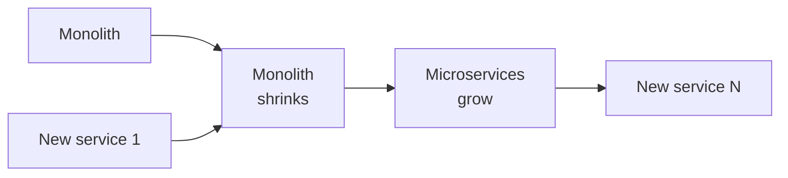

I've sat in this meeting at five companies. New VP, new deck, same line: "The monolith is the problem. We need to do a full rewrite."

Four of those rewrites shipped late, shipped broken, or never shipped. The fifth — Connect Your Care, 2019 to 2021 — shipped, modernized a J2EE/EJB platform a decade in the making, never broke production, and was part of the thesis when UnitedHealth/Optum Financial acquired the company.

We didn't rewrite it. We used the **strangler fig** pattern and ran it boring.

_Figure: the strangler-fig pattern — new grows around old as old shrinks._

## Why the rewrite kills you

A decade-old monolith is not a code problem. It's a *running business* — integration contracts, regulatory commitments, and a long list of undocumented behaviors that support has been quietly accommodating for years. The day you announce a rewrite, the team stops shipping in the old system, the new one rediscovers undocumented behavior the hard way, leadership rotates, and the rewrite gets killed at 60%. You end up with a half-built parallel system and a monolith you never improved.

Not hypothetical. I've watched it happen.

## What we did instead

The pattern is named after a real plant. The strangler fig germinates in the canopy of a host tree, sends roots down around it, and grows into a complete structure over years. By the time the host decays, the fig is already a tree. There was never a cutover.

In software: thin proxy in front of the monolith, day one zero new behavior. Pick the smallest bounded context with a clean data-ownership boundary. Build it as a Spring Boot service. Route traffic behind a per-endpoint feature flag. Watch error rates and business KPIs for two weeks. If anything moves wrong, the flag flips back in seconds. Peel the old code path out. Pick the next.

Two-week loop, repeated until the monolith is small enough to retire or quiet enough to leave alone.

## The boring parts that decide whether it works

The pattern is simple. The discipline is the part teams skip, because none of it feels like progress on the new system:

1. **Anti-corruption layer at every seam.** New service defines its own data model and translates in one file. When the monolith changes shape, one file changes.
2. **Idempotency keys on every cross-seam write.** The proxy will retry. Without idempotency you get duplicate financial records and a very bad week.
3. **Outbox pattern for events.** State change and event-write commit in the same transaction; a drainer publishes. You never lose an event, never publish one that didn't happen.
4. **Feature flags per endpoint, not per release.** Thirty-second rollback versus a war room.
5. **Commit to the loop, not the order.** Which context moves next falls out of where the pain is.

None of these are exotic. They're the things teams pretend they'll add later and then don't.

## What it looked like

Five-person team. J2EE/EJB monolith, Spring Boot taking its place a slice at a time. No cutover weekend, no release outage — we shipped new product surfaces on the new architecture while peeling capability off the old, every two weeks, for two years.

When UnitedHealth/Optum Financial acquired the company in 2021, the modernized architecture was part of the thesis. That outcome is the one I'm proudest of in 25 years — not because the technology was novel, but because we did the boring disciplined thing every two weeks until it compounded.

## When I'd entertain a rewrite

One case: the monolith genuinely cannot scale and the runway is funded. That case is rarer than people think. Most monoliths that "can't scale" scale fine after two focused months on the three hot paths. Test that hypothesis before you spend a year on a parallel build that may not finish.

If you take one thing from this post, take the discipline. The pattern is just the vehicle.

More soon.
